<h1 align="center">Hi there 👋</h1>
<h2 align="center">I'm Nur Amin</h2>
<h3 align="center">Computer Engineer</h3>
<h3 align="center">IoT Engineer</h3>
<h3 align="center">Software Engineer</h3>
<h3 align="center">Tech Enthusiast</h3>

---

## 🌐 Socials

  
  

---

## 💻 Tech Stack

---

## 📊 GitHub Stats

  

---

## 🔥 GitHub Streak

  

---

## 📈 Most Used Languages

  

---

## 🏆 GitHub Trophies

  

---

  ✨ Data diperbarui otomatis setiap hari (10:00 WIB)

